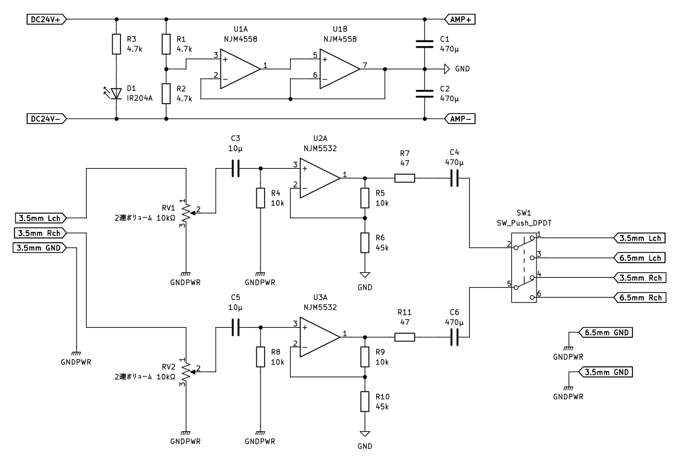
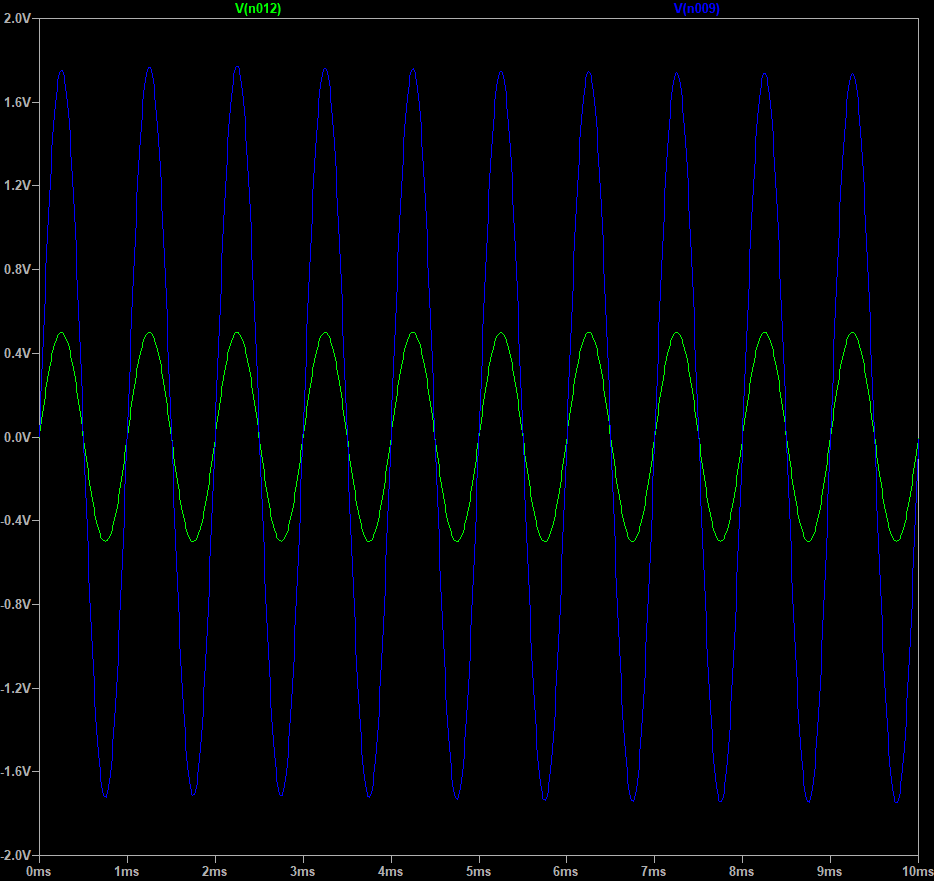
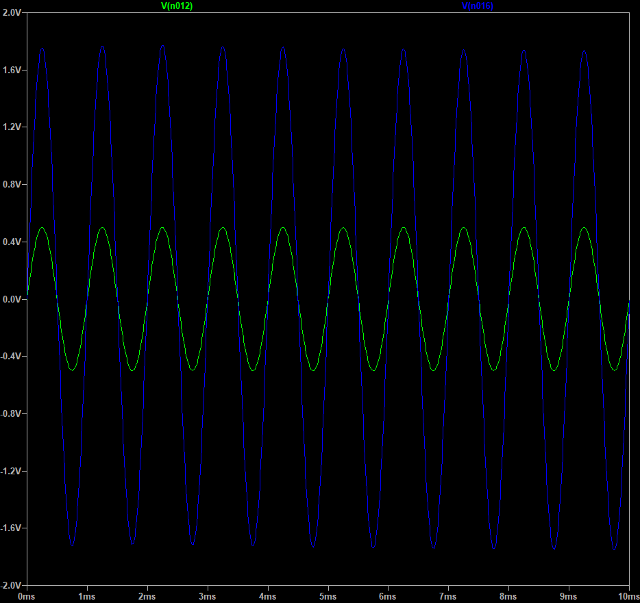
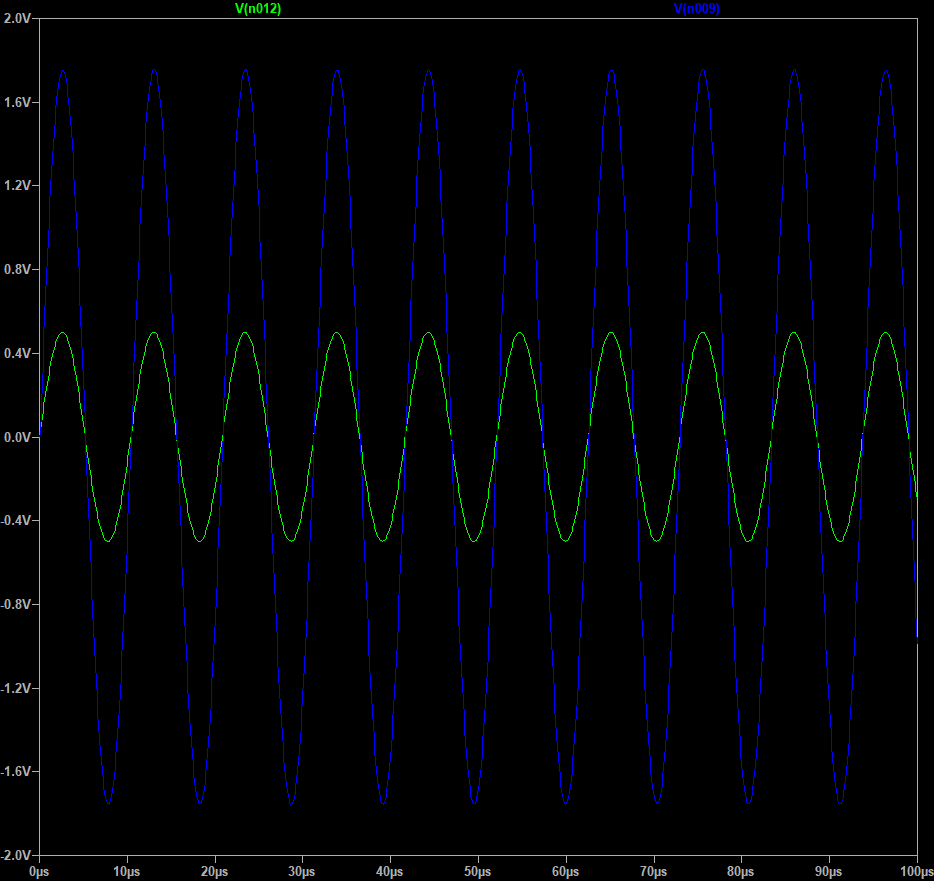
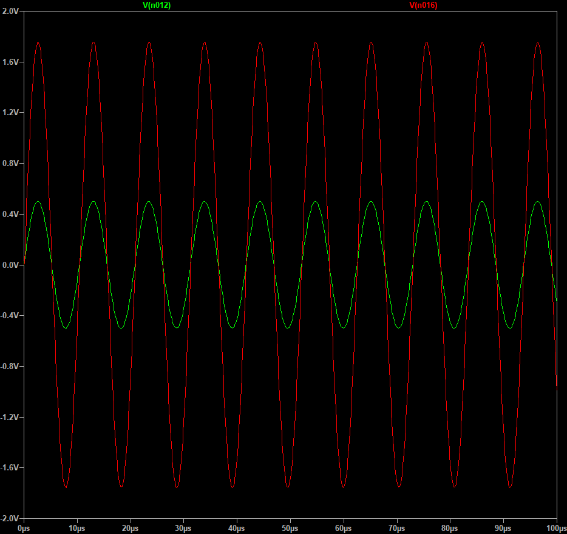
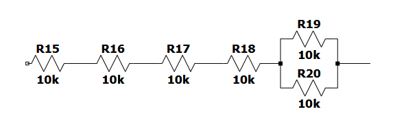

# AUDIOAMP

ヘッドフォンアンプの設計記録。

## 仕様

- INPUT : 3.5mmステレオジャック
- OUTPUT : 3.5mmステレオジャックと6.3mmステレオジャックをスイッチで切り替え
- ハイレゾに対応させる
- 出来る限り安くする

## 回路図



### 特性

- 5.5倍利得
- 電源投下で緑のLEDを光らせる

## 部品

| 部品名 | 型番 | 数量 | 単価 | 小計 | 商品URL |
| :--- | :--- | :---: | :---: | :---: | :--- |
| アンプ | NJM5532DD | 1 | 90 | 90 | [リンク](https://akizukidenshi.com/catalog/g/g117706/) |
| アンプ 電源用 | NJM4558DD | 1 | 30 | 30 | [リンク](https://akizukidenshi.com/catalog/g/g111236/) |
| 小型2連ボリューム 10kΩA | JH16T2A103L20KC | 1 | 130 | 130 | [リンク](https://akizukidenshi.com/catalog/g/g116478/) |
| つまみ | ABS-28 | 1 | 30 | 30 | [リンク](https://akizukidenshi.com/catalog/g/g100253/) |
| 24VACアダプタ | AD-B240P100 | 1 | 1250 | 1250 | [リンク](https://akizukidenshi.com/catalog/g/g110658/) |
| ACアダプタコネクタ | MJ-14 | 1 | 70 | 70 | [リンク](https://akizukidenshi.com/catalog/g/g106342/) |
| 3.5mmステレオジャック | MJ-352W-O | 2 | 140 | 280 | [リンク](https://akizukidenshi.com/catalog/g/g108958/) |
| 6.3mmステレオジャック | MJ-187 N.W | 1 | 200 | 200 | [リンク](https://akizukidenshi.com/catalog/g/g115402/) |
| イヤホンジャック切り替え | - | 1 | 30 | 30 | [リンク](https://akizukidenshi.com/catalog/g/g115706/) |
| 電源用LED | OSG8HA3Z74A | 1 | 10 | 10 | [リンク](https://akizukidenshi.com/catalog/g/g111637/) |
| 電源スイッチ | 1MS1-T1-B1-M1-Q-N | 1 | 120 | 120 | [リンク](https://akizukidenshi.com/catalog/g/g103774/) |
| 4.7k抵抗 100本入り 1% | MFS25F4K7B | 1 | 250 | 250 | [リンク](https://akizukidenshi.com/catalog/g/g108546/) |
| 10k抵抗 100本入り 1% | MFS25F10KB | 1 | 250 | 250 | [リンク](https://akizukidenshi.com/catalog/g/g108550/) |
| 47抵抗 100本入り 1% | MFS25F47RB | 1 | 250 | 250 | [リンク](https://akizukidenshi.com/catalog/g/g108518/) |
| 470μF 電解コンデンサ | 35ZLH470MEFC10X16 | 4 | 40 | 160 | [リンク](https://akizukidenshi.com/catalog/g/g102719/) |
| 10μF 電解コンデンサ | 50PX10MEFC5X11 | 2 | 10 | 20 | [リンク](https://akizukidenshi.com/catalog/g/g117897/) |
| アンプ ICソケット | 2227-8-3 | 2 | 110 | 220 | [リンク](https://akizukidenshi.com/catalog/g/g100017/) |

合計金額: 3,420円

## 入出力波形

> どの波形も緑が入力、青または赤が出力

### サンプル1

条件 : 0.5[V] 1[kHz]

Left Ch



Right Ch



### サンプル2

条件 : 0.5[V] 96[kHz]

Left Ch



Right Ch



## その他

## `45kΩ`抵抗について



このように上の図のように接続すれば抵抗値は
```
10k+10k+10k+10k+(10k*10k)/(10k+10k)=45k
```

